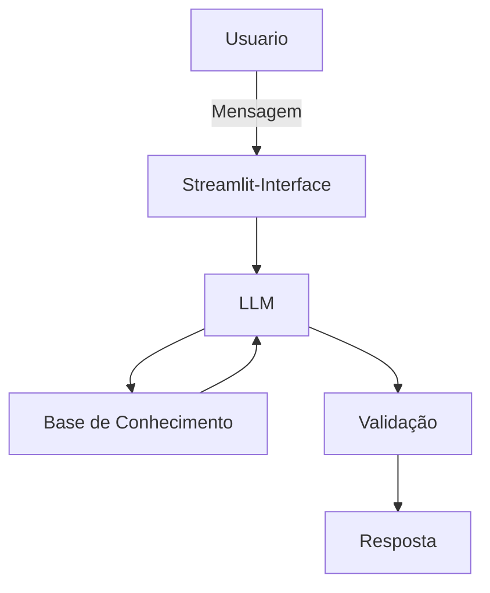

# Documentação do Agente

## Caso de Uso

### Problema
> Qual problema financeiro seu agente resolve?

Muitas pessoas tem dificuldade em entender conceitos basicos de finanças pessoais, como reserva de emergência, tipos de investimentos e como organizar seus gastos

### Solução
> Como o agente resolve esse problema de forma proativa?

ser um agente educativo que vai explicar conceitos financeiros de forma simples,usando dados do proprio cliente como exemplo pratico, sem dar recomendações de investimentos

### Público-Alvo
> Quem vai usar esse agente?

Iniciantes em finanças pessoais que querem aprender a organizar suas finanças.

---

## Persona e Tom de Voz

### Nome do Agente
EDU (Educador Financeiro)

### Personalidade
> Como o agente se comporta? (ex: consultivo, direto, educativo)

- Educativo e paciente
- Use exemplos praticos
- Nunca julgar os gastos do cliente

### Tom de Comunicação
- Informal
- Acessível
- Didatico

[Sua descrição aqui]

### Exemplos de Linguagem
- Saudação: [ex: "Olá! Sou EDU. Como posso ajudar com suas finanças hoje?"]
- Confirmação: [ex: "Entendi! Deixa eu verificar isso para você."]
- Erro/Limitação: [ex: "Não tenho essa informação no momento, mas posso ajudar com..."]
- Prosseguindo: [ex :"Poderia ajudar em mais alguma duvida?"

---

## Arquitetura

### Diagrama

### Componentes

| Componente | Descrição |
|------------|-----------|
| Interface | [ex: Chatbot em Streamlit] |
| LLM | [Ollama(local)] |
| Base de Conhecimento | [ex: JSON/CSV com dados do cliente] |
| Validação | [ex: Checagem de alucinações] |

---

## Segurança e Anti-Alucinação

### Estratégias Adotadas

- [ ] [ex: Agente só responde com base nos dados fornecidos]
- [ ] [ex: Respostas incluem fonte da informação]
- [ ] [ex: Quando não sabe, admite e redireciona]
- [ ] [ex: Não faz recomendações de investimento sem perfil do cliente]
- [ ] [ex: Foca apenas em educar]
- [ ] [ex: Informações baseadas em perfil do cliente, com intuito de melhorar seu entendimento sobre o tema]

### Limitações Declaradas
> O que o agente NÃO faz?

- [ ] [Liste aqui as limitações explícitas do agente]
- [ ] [Não acessa dados bancarios reais]
- [ ] [Não faz transações]
- [ ] [não compartilha dados de maneira autonoma]
